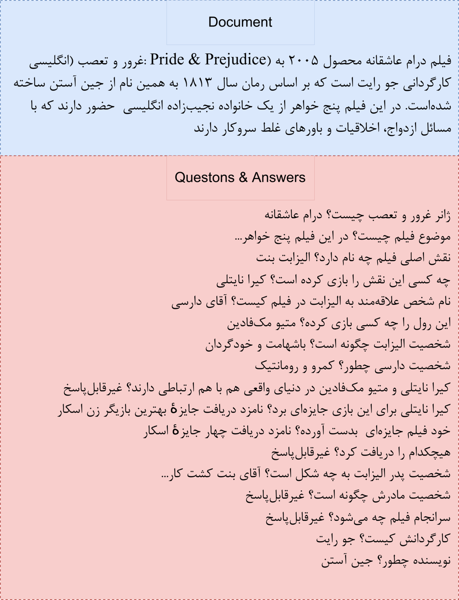

# PCoQA
PCoQA: Persian Conversational Question Answering Dataset
The Paper is currently released on arXiv (). 
The dataset contains **9,026** questions and **870** dialogs. A more detailed statistics of the dataset is presented in the below table. 

## Dataset

## Statistics
The statistics also demnstrate a comparison with English language datasets of QuAC and CoQA.

|                  | PCoQA | CoQA   | QuAC   |
|------------------|-------|--------|--------|
| documents        | 870   | 8,399  | 11,568 |
| questions        | 9,026 | 127,000| 86,568 |
| tokens / document| 505.4 | 271.0  | 396.8  |
| tokens / question| 7.0   | 5.5    | 6.5    |
| tokens / answer  | 18.6  | 7.2    | 15.1   |
| questions / dialog| 10.4 | 15.2   | 7.2    |
| unanswerable rate| 15.7  | 1.3    | 20.2   |

## Results
We have tested two clique of models:
- Baseline Models: ParsBert & XML-Roberta are used.
- Pre-trained Models: Baseline models are pre-trained on PaeSQuAD and QuAC before beinf finetuned. In the below table *X + Y* shows utilizing *Y* which is pre-trained on *X*.

| Model                  | EM    | F1    | HEQ-Q | HEQ-M | HEQ-D |
|------------------------|-------|-------|-------|-------|-------|
| ParsBERT               | 21.82 | 37.06 | 30.70 | 0.0   | 0.0   |
| XLM-Roberta            | 30.47 | 47.78 | 39.51 | 2.45  | 1.63  |
| ParSQuAD + ParsBERT    | 21.74 | 40.48 | 31.95 | 0.8   | 0.0   |
| QuAC + XLM-Roberta     | 32.81 | 51.66 | 43.10 | **3.27** | **1.63** |
| ParSQuAD + XLM-Roberta | **35.93** | **53.75** | **46.21** | 1.63  | 0.8   |
| Human                  | 85.50 | 86.97 | -     | -     | -     |

In the below picure, the mean of F1 along different methods are shown.

